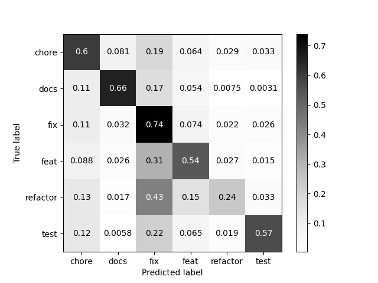
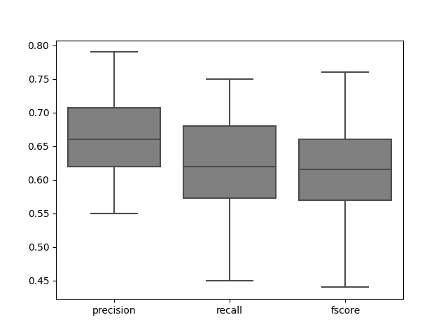
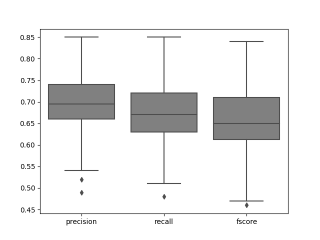
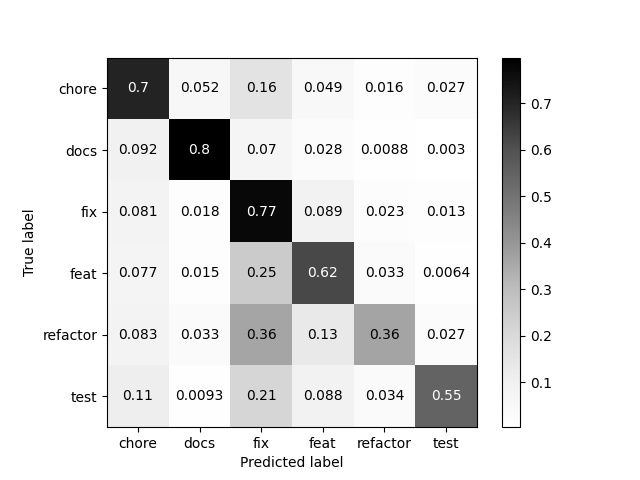
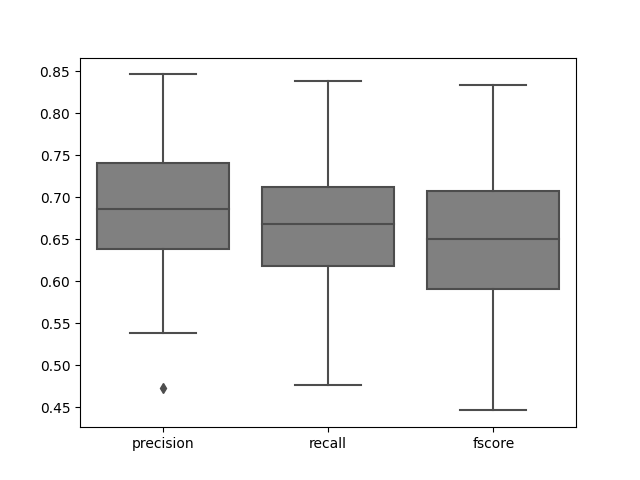
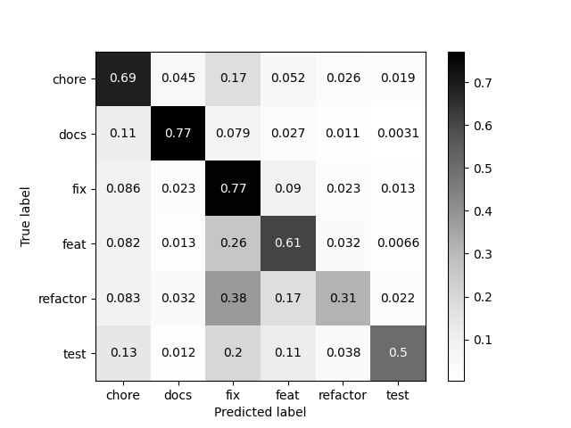

# Results analysis

## Table of contents

* [Tools and packages used for outputs](#Tools-and-packages-used-for-outputs)
* [K fold cross project experiment](#K-fold-cross-project-experiment)
  + [Mann Whitney U statistical test results](#Mann-Whitney-U-statistical-test-results)
  + [Classification report and confusion matrix](#Classification-report-and-confusion-matrix)
  + [Boxplot stats](#Boxplot-stats)
* [Project experiment](#project-experiment)
  + [Mann Whitney U statistical test results](#Mann-Whitney-U-statistical-test-results-for-project-experiment)
  + [Stats for each ratio](#Stats-for-each-ratio)
    + [project ratio 80 and 20](#project-ratio-80-and-20)
    + [project ratio 75 and 25](#project-ratio-75-and-25)
    + [project ratio 60 and 40](#project-ratio-60-and-40)


## Tools and packages used for outputs

package for Mann–Whitney U statistical test:

https://pingouin-stats.org/generated/pingouin.mwu.html

package for boxplots:

[seaborn](https://seaborn.pydata.org/generated/seaborn.boxplot.html) for creating plots

[boxplot_stats](https://matplotlib.org/stable/api/cbook_api.html#matplotlib.cbook.boxplot_stats) for getting the dictionaries of statistics used to draw a series of box and whisker plots.

NOTE: the labels of the boxplots need to be finalized

## K fold cross project experiment

### Mann Whitney U statistical test results
- cross project vs project split 80/20

```

 Result for precision
      U-val       tail     p-val       RBC      CLES
MWU  1028.0  two-sided  0.008314  0.294925  0.352538

 Result for recall
     U-val       tail     p-val       RBC      CLES
MWU  924.0  two-sided  0.001045  0.366255  0.316872

 Result for fscore
     U-val       tail     p-val       RBC      CLES
MWU  985.0  two-sided  0.003693  0.324417  0.337791


```

- cross project vs project split 75/25

```

 Result for precision
      U-val       tail     p-val       RBC      CLES
MWU  1175.0  two-sided  0.082598  0.194102  0.402949

 Result for recall
     U-val       tail     p-val       RBC      CLES
MWU  985.0  two-sided  0.003693  0.324417  0.337791

 Result for fscore
      U-val       tail     p-val       RBC      CLES
MWU  1100.0  two-sided  0.028046  0.245542  0.377229


```

- cross project vs project split 60/40

```
 Result for precision
      U-val       tail     p-val       RBC      CLES
MWU  1358.0  two-sided  0.540952  0.068587  0.465706

 Result for recall
      U-val       tail     p-val       RBC      CLES
MWU  1130.0  two-sided  0.044187  0.224966  0.387517

 Result for fscore
      U-val       tail     p-val       RBC     CLES
MWU  1233.0  two-sided  0.167762  0.154321  0.42284

```

### Classification report and confusion matrix



```
              precision    recall  f1-score   support

       chore       0.63      0.60      0.62     50087
        docs       0.70      0.66      0.68     27454
         fix       0.60      0.54      0.57     37361
        feat       0.58      0.74      0.65     68051
    refactor       0.51      0.24      0.33     18544
        test       0.58      0.57      0.57     11695

    accuracy                           0.61    213192
   macro avg       0.60      0.56      0.57    213192
weighted avg       0.61      0.61      0.60    213192

```

detailed support:

```

chore_total       50087
docs_total        27454
feat_total        37361
fix_total         68051
refactor_total    18544
test_total        11695

Total count of commits in total set:  213192

```

### Boxplot stats

Please see [classification_report](commitcanvas_models/classification_reports/cross_project/classification_report.csv) for more details about the individual projects such as the size of test set, train set and total set



```

Overall boxplot stats for precision
[{'mean': 0.6643824420212243, 'iqr': 0.0877045880012759, 'cilo': 0.6436373091562423, 'cihi': 0.6811134688524106, 'whishi': 0.7860460812834456, 'whislo': 0.5533500322831186, 'fliers': array([], dtype=float64), 'q1': 0.6189582442452561, 'med': 0.6623753890043265, 'q3': 0.706662832246532}]

Projects close to value of median
                       name  precision    recall  ...  fix_test  refactor_test  test_test
16  material-components-web   0.664472  0.654463  ...       912            212        150
21              angular-cli   0.660279  0.620437  ...      2133            773        508
32                  vue-cli   0.656447  0.649621  ...       950            135        143
41         electron-builder   0.658826  0.624806  ...       872             98         74

[4 rows x 16 columns]

Project at the value of whishi
      name  precision    recall    fscore  ...  feat_test  fix_test  refactor_test  test_test
18  RSSHub   0.786046  0.753788  0.764262  ...       1398       907             50         79

[1 rows x 16 columns]

Project at the value of whislo
       name  precision    recall    fscore  ...  feat_test  fix_test  refactor_test  test_test
2  element3    0.55335  0.466616  0.449768  ...         57       337            244         98

[1 rows x 16 columns]


Overall boxplot stats for recall
[{'mean': 0.6197018774100682, 'iqr': 0.10484613485488481, 'cilo': 0.5967510648027136, 'cihi': 0.6415518053670556, 'whishi': 0.7537878787878788, 'whislo': 0.4522008253094911, 'fliers': array([], dtype=float64), 'q1': 0.574678375828996, 'med': 0.6191514350848846, 'q3': 0.6795245106838808}]

Projects close to value of median
                name  precision    recall    fscore  ...  feat_test  fix_test  refactor_test  test_test
1    ionic-framework   0.646184  0.617866  0.609424  ...        716      2820            665        520
19     loopback-next   0.708908  0.624796  0.648031  ...        831       764            144        104
21       angular-cli   0.660279  0.620437  0.617078  ...        906      2133            773        508
38                G2   0.648133  0.623472  0.615419  ...        494       743            143        110
41  electron-builder   0.658826  0.624806  0.630712  ...        567       872             98         74
45             lerna   0.609752  0.616552  0.599654  ...        265       356            177        125

[6 rows x 16 columns]

Project at the value of whishi
      name  precision    recall    fscore  ...  feat_test  fix_test  refactor_test  test_test
18  RSSHub   0.786046  0.753788  0.764262  ...       1398       907             50         79

[1 rows x 16 columns]

Project at the value of whislo
                  name  precision    recall  fscore  ...  feat_test  fix_test  refactor_test  test_test
40  super-productivity   0.709187  0.452201    0.44  ...       3393      1206            626        101

[1 rows x 16 columns]


Overall boxplot stats for fscore
[{'mean': 0.6140055812703538, 'iqr': 0.09280962603112752, 'cilo': 0.5932224608177126, 'cihi': 0.6328800026379147, 'whishi': 0.7642624581292277, 'whislo': 0.4400000913544323, 'fliers': array([], dtype=float64), 'q1': 0.5698440240035909, 'med': 0.6130512317278136, 'q3': 0.6626536500347184}]

Projects close to value of median
                name  precision    recall    fscore  ...  feat_test  fix_test  refactor_test  test_test
1    ionic-framework   0.646184  0.617866  0.609424  ...        716      2820            665        520
10  instantsearch.js   0.651566  0.607637  0.608411  ...        433       606             65         95
44           stryker   0.624049  0.613475  0.610684  ...        330       261             91        116
53              taro   0.616371  0.614679  0.607543  ...       1253      2611            308        129

[4 rows x 16 columns]

Project at the value of whishi
      name  precision    recall    fscore  ...  feat_test  fix_test  refactor_test  test_test
18  RSSHub   0.786046  0.753788  0.764262  ...       1398       907             50         79

[1 rows x 16 columns]

Project at the value of whislo
                  name  precision    recall  fscore  ...  feat_test  fix_test  refactor_test  test_test
40  super-productivity   0.709187  0.452201    0.44  ...       3393      1206            626        101

[1 rows x 16 columns]

```
## Project experiment

### Mann Whitney U statistical test results for project experiment

- project 80/20 vs project 75/25

```

 Result for precision
      U-val       tail    p-val       RBC      CLES
MWU  1583.0  two-sided  0.44428 -0.085734  0.542867

 Result for recall
      U-val       tail     p-val       RBC      CLES
MWU  1513.5  two-sided  0.735404 -0.038066  0.519033

 Result for fscore
      U-val       tail     p-val       RBC      CLES
MWU  1548.0  two-sided  0.582368 -0.061728  0.530864


```

- project 80/20 vs project 60/40

```

 Result for precision
      U-val       tail     p-val       RBC      CLES
MWU  1745.0  two-sided  0.078342 -0.196845  0.598422

 Result for recall
      U-val       tail     p-val       RBC      CLES
MWU  1655.0  two-sided  0.227283 -0.135117  0.567558

 Result for fscore
      U-val       tail     p-val       RBC      CLES
MWU  1685.0  two-sided  0.164007 -0.155693  0.577846


```

- project 75/25 vs 60/40

```

 Result for precision
      U-val       tail     p-val       RBC     CLES
MWU  1618.0  two-sided  0.327066 -0.109739  0.55487

 Result for recall
      U-val       tail    p-val       RBC      CLES
MWU  1593.0  two-sided  0.40856 -0.092593  0.546296

 Result for fscore
      U-val       tail     p-val      RBC      CLES
MWU  1596.0  two-sided  0.398187 -0.09465  0.547325

```

### Stats for each ratio

### project ratio 80 and 20

Please see [classification_report_80_20](commitcanvas_models/classification_reports/project/classification_report_80_20.csv) for more details about the individual projects such as the size of test set, train set and total set

box and whisker plot:



confusion matrix:



classification report:

```

              precision    recall  f1-score   support

       chore       0.73      0.70      0.71     10442
        docs       0.82      0.80      0.81      5930
         fix       0.62      0.62      0.62      6731
        feat       0.64      0.77      0.70     13225
    refactor       0.63      0.36      0.46      3940
        test       0.67      0.55      0.60      2368

    accuracy                           0.68     42636
   macro avg       0.69      0.63      0.65     42636
weighted avg       0.69      0.68      0.68     42636

```

detailed support

```

chore_total       50087
docs_total        27454
feat_total        37361
fix_total         68051
refactor_total    18544
test_total        11695

Total count of commits in total set:  213192 

chore_train       39645
docs_train        21524
feat_train        30630
fix_train         54826
refactor_train    14604
test_train         9327

Total count of commits in train set:  170556 

chore_test       10442
docs_test         5930
feat_test         6731
fix_test         13225
refactor_test     3940
test_test         2368

Total count of commits in test set:  42636
```

```

Overall boxplot stats for precision:

[{'mean': 0.6967467811409221, 'iqr': 0.08302081878637113, 'cilo': 0.6798036376315896, 'cihi': 0.7152784233166832, 'whishi': 0.8499977479220094, 'whislo': 0.5444600808304615, 'fliers': array([0.48644421, 0.52120298]), 'q1': 0.6585506351182077, 'med': 0.6975410304741364, 'q3': 0.7415714539045788}]

Projects close to value of median
         name  precision    recall    fscore  ...  feat_test  fix_test  refactor_test  test_test
35  webiny-js   0.702621  0.710410  0.690045  ...        273       812             58         90
53       taro   0.704689  0.630303  0.649165  ...        147       634             51         11

[2 rows x 22 columns]

Project at the value of whishi
             name  precision    recall    fscore  ...  feat_test  fix_test  refactor_test  test_test
19  loopback-next   0.849998  0.846782  0.844628  ...        103        94              9         11

[1 rows x 22 columns]

Project at the value of whislo
       name  precision    recall   fscore  ...  feat_test  fix_test  refactor_test  test_test
2  element3    0.54446  0.515152  0.50482  ...          8        60             93         24

[1 rows x 22 columns]

Far outlier projects
         name  precision    recall    fscore  ...  feat_test  fix_test  refactor_test  test_test
37  chakra-ui   0.486444  0.512563  0.462586  ...        120       182             33         14
44    stryker   0.521203  0.544248  0.509457  ...         68        56             18         22

[2 rows x 22 columns]


Overall boxplot stats for recall
[{'mean': 0.6726836867098982, 'iqr': 0.08891262246525411, 'cilo': 0.6496211976680732, 'cihi': 0.6876135503425367, 'whishi': 0.8467824310520939, 'whislo': 0.5125628140703518, 'fliers': array([0.47962382]), 'q1': 0.630622009569378, 'med': 0.668617374005305, 'q3': 0.7195346320346321}]

Projects close to value of median
                name  precision    recall    fscore  ...  feat_test  fix_test  refactor_test  test_test
0          sequelize   0.668048  0.668966  0.644435  ...         22       116             41         23
10  instantsearch.js   0.633515  0.666667  0.646173  ...        137       134             26         19
15    vue-test-utils   0.735112  0.668269  0.676350  ...         23        46              4          7

[3 rows x 22 columns]

Project at the value of whishi
             name  precision    recall    fscore  ...  feat_test  fix_test  refactor_test  test_test
19  loopback-next   0.849998  0.846782  0.844628  ...        103        94              9         11

[1 rows x 22 columns]

Project at the value of whislo
         name  precision    recall    fscore  ...  feat_test  fix_test  refactor_test  test_test
37  chakra-ui   0.486444  0.512563  0.462586  ...        120       182             33         14

[1 rows x 22 columns]

Far outlier projects
            name  precision    recall    fscore  ...  feat_test  fix_test  refactor_test  test_test
23  ng-bootstrap   0.671384  0.479624  0.466388  ...         55        94             19         58

[1 rows x 22 columns]


Overall boxplot stats for fscore
[{'mean': 0.6590521285666496, 'iqr': 0.09228130236068166, 'cilo': 0.6325019411071899, 'cihi': 0.6719337302878083, 'whishi': 0.8446281303081813, 'whislo': 0.4783759007216093, 'fliers': array([0.46638805, 0.46258636]), 'q1': 0.6153682565999795, 'med': 0.6522178356974991, 'q3': 0.7076495589606612}]

Projects close to value of median
                name  precision    recall    fscore  ...  feat_test  fix_test  refactor_test  test_test
3               vite   0.658398  0.653951  0.650501  ...         42       168             18          9
9             gatsby   0.660502  0.652096  0.651631  ...        206       573             17         16
10  instantsearch.js   0.633515  0.666667  0.646173  ...        137       134             26         19
28        components   0.754021  0.683039  0.652804  ...        197       619            183         62
31              pnpm   0.709820  0.641161  0.653925  ...         97       403             67        120
51              jina   0.672981  0.643072  0.650254  ...         95       169             92         65
52          material   0.682166  0.685801  0.649135  ...         60       355             22          6
53              taro   0.704689  0.630303  0.649165  ...        147       634             51         11

[8 rows x 22 columns]

Project at the value of whishi
             name  precision    recall    fscore  ...  feat_test  fix_test  refactor_test  test_test
19  loopback-next   0.849998  0.846782  0.844628  ...        103        94              9         11

[1 rows x 22 columns]

Project at the value of whislo
                       name  precision    recall  ...  fix_test  refactor_test  test_test
16  material-components-web   0.630839  0.523449  ...       183            115         25

[1 rows x 22 columns]

Far outlier projects
            name  precision    recall    fscore  ...  feat_test  fix_test  refactor_test  test_test
23  ng-bootstrap   0.671384  0.479624  0.466388  ...         55        94             19         58
37     chakra-ui   0.486444  0.512563  0.462586  ...        120       182             33         14

[2 rows x 22 columns]


```

#### project ratio 75 and 25

Please see [classification_report_75_25](commitcanvas_models/classification_reports/project/classification_report_75_25.csv) for more details about the individual projects such as the size of test set, train set and total set

box and whisker plot



confusion matrix:


classification report:

```

              precision    recall  f1-score   support

       chore       0.73      0.70      0.71     12952
        docs       0.82      0.80      0.81      7349
         fix       0.60      0.62      0.61      8377
        feat       0.64      0.77      0.70     16639
    refactor       0.61      0.35      0.44      4942
        test       0.71      0.51      0.59      3038

    accuracy                           0.68     53297
   macro avg       0.69      0.63      0.65     53297
weighted avg       0.68      0.68      0.68     53297

```

```

detailed support:

chore_total       50087
docs_total        27454
feat_total        37361
fix_total         68051
refactor_total    18544
test_total        11695

Total count of commits in total set:  213192 

chore_train       37135
docs_train        20105
feat_train        28984
fix_train         51412
refactor_train    13602
test_train         8657

Total count of commits in train set:  159895 

chore_test       12952
docs_test         7349
feat_test         8377
fix_test         16639
refactor_test     4942
test_test         3038

Total count of commits in test set:  53297 

```

```

Overall boxplot stats for precision
[{'mean': 0.6874980597869412, 'iqr': 0.101391283492001, 'cilo': 0.6638729151390202, 'cihi': 0.707197398139732, 'whishi': 0.846132881621394, 'whislo': 0.5387040378801586, 'fliers': array([0.47283491]), 'q1': 0.6387375951191004, 'med': 0.6855351566393761, 'q3': 0.7401288786111014}]

Projects close to value of median
                    name  precision    recall  ...  fix_test  refactor_test  test_test
8                rest.js   0.691869  0.616667  ...        52             15         43
9                 gatsby   0.687122  0.668424  ...       715             35         20
26  camunda-bpm-platform   0.693950  0.671917  ...       608              9        134
45                 lerna   0.689194  0.665746  ...        57             45         38

[4 rows x 22 columns]

Project at the value of whishi
             name  precision    recall   fscore  ...  feat_test  fix_test  refactor_test  test_test
19  loopback-next   0.846133  0.838235  0.83349  ...        138       129             10         20

[1 rows x 22 columns]

Project at the value of whislo
       name  precision    recall    fscore  ...  feat_test  fix_test  refactor_test  test_test
44  stryker   0.538704  0.535461  0.500884  ...         84        62             22         36

[1 rows x 22 columns]

Far outlier projects
                       name  precision    recall  ...  fix_test  refactor_test  test_test
16  material-components-web   0.472835  0.526634  ...       229            124         28

[1 rows x 22 columns]


Overall boxplot stats for recall
[{'mean': 0.6677507440656335, 'iqr': 0.09450401376286988, 'cilo': 0.6473543438426841, 'cihi': 0.6877358973328469, 'whishi': 0.8382352941176471, 'whislo': 0.4761904761904761, 'fliers': array([], dtype=float64), 'q1': 0.6179366685945633, 'med': 0.6675451205877655, 'q3': 0.7124406823574332}]

Projects close to value of median
                    name  precision    recall  ...  fix_test  refactor_test  test_test
3                   vite   0.666478  0.666667  ...       218             25         11
9                 gatsby   0.687122  0.668424  ...       715             35         20
26  camunda-bpm-platform   0.693950  0.671917  ...       608              9        134
45                 lerna   0.689194  0.665746  ...        57             45         38

[4 rows x 22 columns]

Project at the value of whishi
             name  precision    recall   fscore  ...  feat_test  fix_test  refactor_test  test_test
19  loopback-next   0.846133  0.838235  0.83349  ...        138       129             10         20

[1 rows x 22 columns]

Project at the value of whislo
            name  precision   recall    fscore  ...  feat_test  fix_test  refactor_test  test_test
23  ng-bootstrap   0.630435  0.47619  0.446242  ...         64       112             26         64

[1 rows x 22 columns]


Overall boxplot stats for fscore
[{'mean': 0.6511090296462904, 'iqr': 0.11654254785934115, 'cilo': 0.6257214368531346, 'cihi': 0.6755200532597413, 'whishi': 0.8334896182757181, 'whislo': 0.4462423902793672, 'fliers': array([], dtype=float64), 'q1': 0.5904016824954066, 'med': 0.650620745056438, 'q3': 0.7069442303547477}]

Projects close to value of median
                  name  precision    recall  ...  fix_test  refactor_test  test_test
8              rest.js   0.691869  0.616667  ...        52             15         43
40  super-productivity   0.643831  0.684319  ...       313            172         92
45               lerna   0.689194  0.665746  ...        57             45         38
51                jina   0.665644  0.649398  ...       207            115         84

[4 rows x 22 columns]

Project at the value of whishi
             name  precision    recall   fscore  ...  feat_test  fix_test  refactor_test  test_test
19  loopback-next   0.846133  0.838235  0.83349  ...        138       129             10         20

[1 rows x 22 columns]

Project at the value of whislo
            name  precision   recall    fscore  ...  feat_test  fix_test  refactor_test  test_test
23  ng-bootstrap   0.630435  0.47619  0.446242  ...         64       112             26         64

[1 rows x 22 columns]

```

#### project ratio 60 and 40

Please see [classification_report_60_40](commitcanvas_models/classification_reports/project/classification_report_60_40.csv) for more details about the individual projects such as the size of test set, train set and total set

box and whisker plot:


confusion matrix:



classification report:

```

              precision    recall  f1-score   support

       chore       0.70      0.69      0.69     20134
        docs       0.82      0.77      0.79     11683
         fix       0.59      0.61      0.60     13648
        feat       0.64      0.77      0.70     27238
    refactor       0.56      0.31      0.40      7658
        test       0.70      0.50      0.59      4914

    accuracy                           0.67     85275
   macro avg       0.67      0.61      0.63     85275
weighted avg       0.67      0.67      0.66     85275

```

detailed support

```

chore_total       50087
docs_total        27454
feat_total        37361
fix_total         68051
refactor_total    18544
test_total        11695

Total count of commits in total set:  213192 

chore_train       29953
docs_train        15771
feat_train        23713
fix_train         40813
refactor_train    10886
test_train         6781

Total count of commits in train set:  127917 

chore_test       20134
docs_test        11683
feat_test        13648
fix_test         27238
refactor_test     7658
test_test         4914

Total count of commits in test set:  85275

```

```

Overall boxplot stats for precision
[{'mean': 0.6719650274624542, 'iqr': 0.10007498016974092, 'cilo': 0.6446849885236026, 'cihi': 0.6874470152761545, 'whishi': 0.8266500447980617, 'whislo': 0.5131043622532878, 'fliers': array([0.47816699]), 'q1': 0.6300341333851517, 'med': 0.6660660018998785, 'q3': 0.7301091135548926}]

Projects close to value of median
                  name  precision    recall  ...  fix_test  refactor_test  test_test
8              rest.js   0.673556  0.531250  ...        78             29         74
22                deno   0.672821  0.641388  ...       287            120         26
40  super-productivity   0.669648  0.702494  ...       479            285         92

[3 rows x 22 columns]

Project at the value of whishi
      name  precision    recall   fscore  ...  feat_test  fix_test  refactor_test  test_test
18  RSSHub    0.82665  0.815835  0.81463  ...        644       392              5          7

[1 rows x 22 columns]

Project at the value of whislo
       name  precision    recall    fscore  ...  feat_test  fix_test  refactor_test  test_test
44  stryker   0.513104  0.509978  0.468745  ...        131        90             35         60

[1 rows x 22 columns]

Far outlier projects
        name  precision    recall    fscore  ...  feat_test  fix_test  refactor_test  test_test
47  superset   0.478167  0.548157  0.474961  ...        182       327             54         91

[1 rows x 22 columns]


Overall boxplot stats for recall
[{'mean': 0.6530762020312287, 'iqr': 0.10678781908457413, 'cilo': 0.6301363171131406, 'cihi': 0.6757667391106855, 'whishi': 0.8158347676419966, 'whislo': 0.5037481259370314, 'fliers': array([], dtype=float64), 'q1': 0.6057500133686264, 'med': 0.652951528111913, 'q3': 0.7125378324532006}]

Projects close to value of median
                name  precision    recall    fscore  ...  feat_test  fix_test  refactor_test  test_test
0          sequelize   0.662484  0.653448  0.636258  ...         51       242             59         28
41  electron-builder   0.639938  0.652455  0.624618  ...        189       400             23         18

[2 rows x 22 columns]

Project at the value of whishi
      name  precision    recall   fscore  ...  feat_test  fix_test  refactor_test  test_test
18  RSSHub    0.82665  0.815835  0.81463  ...        644       392              5          7

[1 rows x 22 columns]

Project at the value of whislo
         name  precision    recall    fscore  ...  feat_test  fix_test  refactor_test  test_test
34  verdaccio   0.571202  0.503748  0.495396  ...         82       111             67         26

[1 rows x 22 columns]


Overall boxplot stats for fscore
[{'mean': 0.6354797465713554, 'iqr': 0.11423187311534655, 'cilo': 0.6019060070707232, 'cihi': 0.6507172724426202, 'whishi': 0.8146301562109642, 'whislo': 0.4504725226004722, 'fliers': array([], dtype=float64), 'q1': 0.5829110464646108, 'med': 0.6263116397566717, 'q3': 0.6971429195799573}]

Projects close to value of median
    name  precision    recall    fscore  ...  feat_test  fix_test  refactor_test  test_test
3   vite   0.653316  0.643537  0.626732  ...         94       348             53         14
31  pnpm   0.678346  0.611697  0.626214  ...        232       829            195        183
53  taro   0.644537  0.635223  0.626409  ...        389      1189            156         27

[3 rows x 22 columns]

Project at the value of whishi
      name  precision    recall   fscore  ...  feat_test  fix_test  refactor_test  test_test
18  RSSHub    0.82665  0.815835  0.81463  ...        644       392              5          7

[1 rows x 22 columns]

Project at the value of whislo
            name  precision   recall    fscore  ...  feat_test  fix_test  refactor_test  test_test
23  ng-bootstrap   0.640997  0.50627  0.450473  ...        110       183             44         85

[1 rows x 22 columns]


```